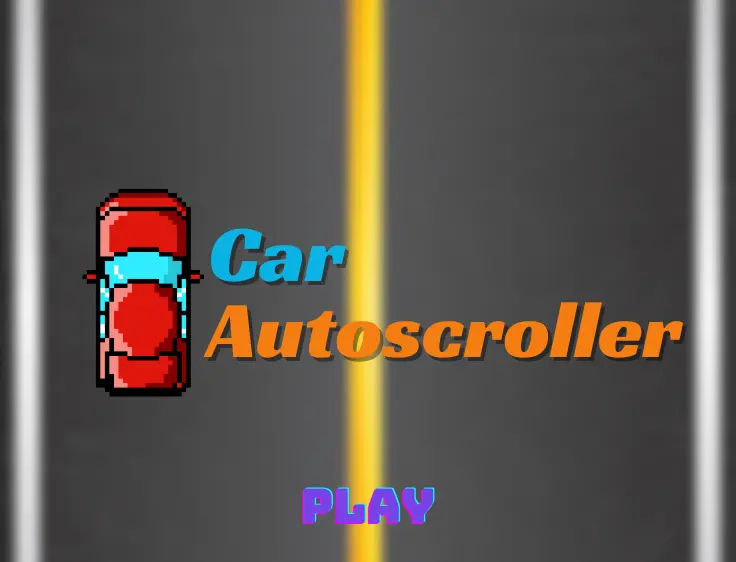
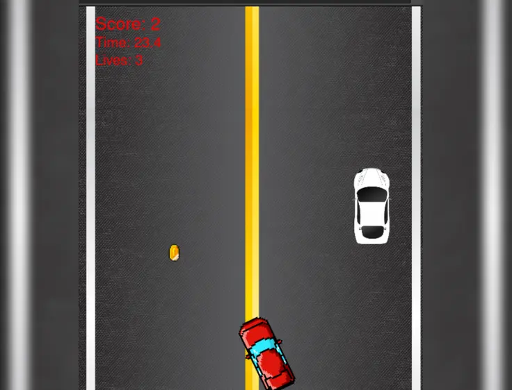
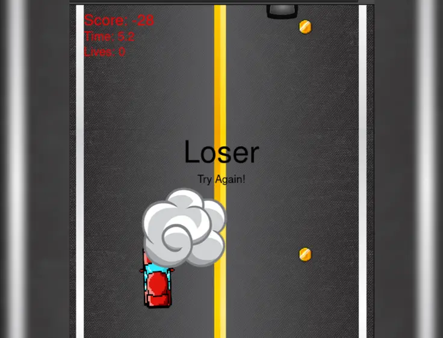

# 🚘 Car Obstacle Game

**Description:**  
A simple 2D endless driving game built with **pure JavaScript** and the **HTML Canvas API**.

This project simulates an endless road where the player must avoid obstacles while collecting points.  
It’s powered entirely by browser-native technologies — no frameworks, just **vanilla JS**, **Canvas drawing**, and **basic physics logic**.  
This project helped me strengthen my understanding of **game loops**, **real-time rendering**, and **collision detection**.

---

## 🖼️ Preview

|  |  |
|---------------------------------------------|------------------------------------------|
|    |                                          |

---

## 🕹️ Features

- 🏎️ Endless obstacle avoidance gameplay  
- 💥 Real-time collision detection  
- ⏱️ Smooth rendering using Canvas and JS game loop  
- 🎯 Score tracking system  
- 🧠 Lightweight logic — no external libraries  
- 🌐 Runs directly in any modern browser  

---

## 🧠 Technologies Used

| Technology | Purpose |
|-------------|----------|
| 🟨 **JavaScript** | Core game logic and rendering control |
| 🧩 **HTML5 Canvas** | Real-time drawing and visual output |
| 🎨 **CSS3** | Styling for layout and game environment |

---

## 🚀 Hosting

- Deployed on **GitHub Pages** for easy access and static hosting.

---

## 🧩 Play Now

